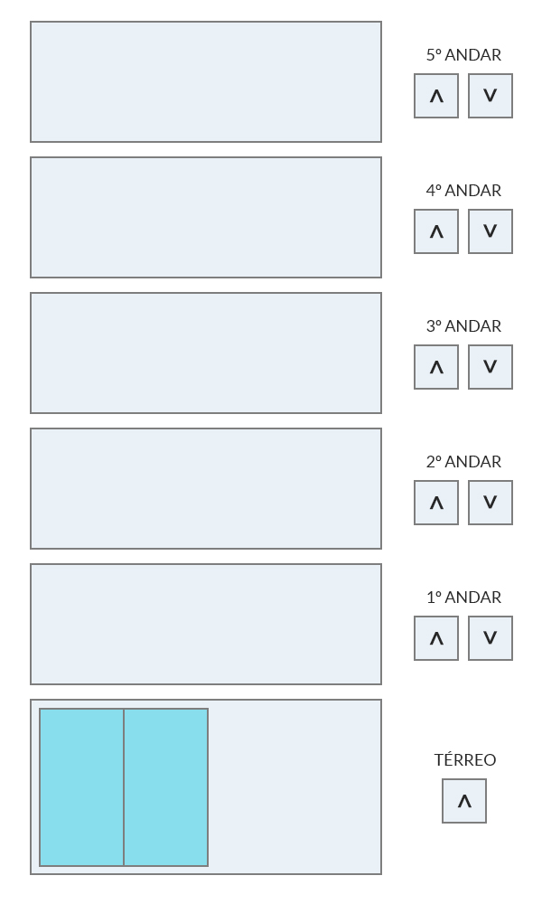

# webdev-teste-elevador

## Descrição
Construa um elevador utilizando html, javascript e css.
Será considerado a mesma dinâmica de um elevador real e todos os casos de uso abaixo, precisam ser desenvolvidos.

## Requisitos
- O elevador possui 5 andares;
- Ele se move para cima ou para baixo conforme o andar é solicitado;
- As portas abrem e permanecem abertas durante alguns segundos assim que o elevador chega no andar solicitado;
- Se o andar onde o elevador está for solicitado novamente, as portas devem se abrir (se estiverem fechando, devem se abrir novamente);
- O elevador precisa parar nos andares em ordem de prioridade/velocidade.
   
  Ex: Se a direção do elevador for para cima e, ele for solicitado o 4º andar e depois no 3º, a ordem de parada deverá ser 3º andar e só então o 4º.

## Objetivos
Essa terefa tem como objetivo avaliar:
 - Nível de conhecimento em: HTML
 - Nível de conhecimento em: CSS
 - Nível de conhecimento em: Lógica de programação
 - Nível de conhecimento em: JavaScript

## Resumo
A ideia é ter uma aplicação simples que, represente visualmente um elevador (sem necessáriamente ter um nível de realismo) e que tenha o funcionamento correto através de um bom pensamento lógico.

## Prazo
O prazo para realização dessa tarefa é de 3 dias.

## Entrega
Submeter o seu projeto no seu repositório pessoal do GiHub - (https://github.com/)[https://github.com/]
Enviar o projeto de forma que, os arquivos não tenham nenhuma compressão, possibilitando assim a análise do código.
Nos enviar o link.
